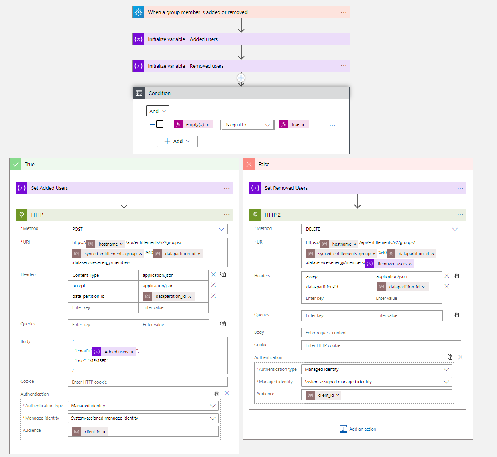
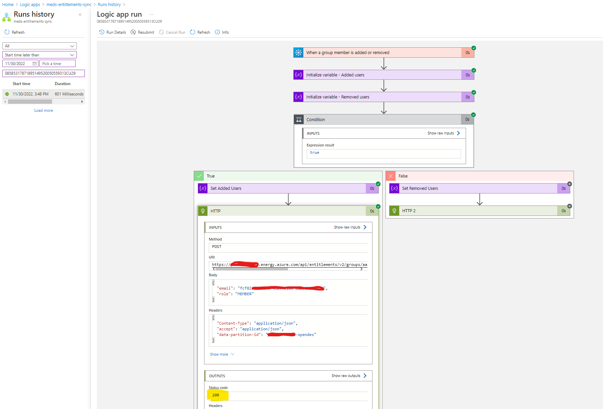
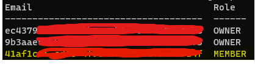

# Description
This guide will help you create a Logic App which synchronizes changes made to an Azure AD group into an Entitlements group in [Azure Data Manager for Energy](https://azure.microsoft.com/en-us/products/energy-data-services/#overview).

The solution supports the [Azure AD Dynamic group assignment](https://learn.microsoft.com/en-us/azure/active-directory/enterprise-users/groups-dynamic-membership) for a policy-driven permission assignment. 

While this guide is written for Azure Data Manager for Energy, it should work with any OSDU instance.

I would suggest monitoring this Logic App's runs through Azure Monitor and alert on failed runs. It could also be a good idea to create some consistency validation to verify that the members are in sync in both groups, especially since it is a one-way sync and users added directly through Entitlements API will not be added to the Azure AD group.

# Overview


# Prerequisites
<details>
<summary>OSDU CLI</summary>

1. Generate a [Refresh Token](https://learn.microsoft.com/en-us/azure/energy-data-services/how-to-generate-refresh-token) for your Azure Data Manager for Energy instance.
2. Download [OSDU CLI](https://community.opengroup.org/osdu/platform/data-flow/data-loading/osdu-cli) from the Open Source Community.
3. Authenticate to your Azure Data Manager for Energy instance by running the following command.
```Powershell
osdu config update
```
4. Enter all the instance details, see example below.
    <details>
    <summary>Example input</summary>

    ```conf
    server = https://<instance-name>.energy.azure.com
    crs_catalog_url = /api/crs/catalog/v2/
    crs_converter_url = /api/crs/converter/v2/
    entitlements_url = /api/entitlements/v2/
    file_url = /api/file/v2/
    legal_url = /api/legal/v1/
    schema_url = /api/schema-service/v1/
    search_url = /api/search/v2/
    storage_url = /api/storage/v2/
    unit_url = /api/unit/v3/
    workflow_url = /api/workflow/v1/
    data_partition_id = <data-partition-id>
    legal_tag = <legal-tag-id>
    acl_viewer = data.default.viewers@<data-partition-id>.dataservices.energy
    acl_owner = data.default.owners@<data-partition-id>.dataservices.energy
    authentication_mode = refresh_token
    token_endpoint = https://login.microsoftonline.com/<tenant-id>/oauth2/v2.0/token
    refresh_token = 0.ARoBv4j5cvDGr0GRqy18...
    client_id = <meds-appreg-client-id>
    client_secret =
    ```
5. Make sure that it is authenticated to your instance by running the following command.

    ```powershell
    osdu status
    ```

    This should return the following output:
    ```powershell
    PS C:\Users\admin> osdu status
    CRS Catalog service  200         OK
    CRS Converter service 200        OK
    File service         200         OK
    Entitlements Service 200         OK
    Legal service        200         OK
    Schema service       200         OK
    Search service       200         OK
    Storage service      200         OK
    Unit service         200         OK
    Workflow service     200         OK
    ```
</details>

<details>
<summary>Azure CLI</summary>

Download from [aka.ms/azurecli](https://aka.ms/azurecli).  
Login to the Azure CLI using the command below, and your user with subscription owner rights:
```Powershell
az login
```
Verify that the right subscription is selected:
```Powershell
az account show
```
If the correct subscription is not selected, run the following command:
```Powershell
az account set --subscription <subscription-id>
```
</details>

<details>
<summary>Azure CLI Logic App Extension</summary>

1. Install the module
    ```Powershell
    az extension add --name logic
    ```
</details>

# Deploy

1. Create an Entitlements group using the OSDU CLI called meds-users.
    ```powershell
    $entitlementsGroup = "meds-users" # Define the name of your Entitlements group

    osdu entitlements groups add -g $entitlementsGroup -d "User group synced from Azure AD by Logic App"
    ```
2. Create an M365 Azure AD group that will be the used as the source, we'll be using the Graph API for this step, but feel free to use Azure Portal or similar. Access token can be fetched easily by logging into [Graph Explorer](https://developer.microsoft.com/en-us/graph/graph-explorer).

    Note the Object ID output.

    ```powershell
    # Define variables
    $accessToken = "eyJ0eXAiOiJKV1QiL..." # Graph API access token with Directory.ReadWrite.All and Group.ReadWrite.All
    $azureAdGroup = "meds-users" # Set the name of the Azure AD source group

    # Create request header
    $headers = @{
    "Authorization" = "Bearer $accessToken"
    }

    # Create request body with M365 group properties
    $groupBody = @"{
        "displayName": "$azureAdGroup",
        "mailEnabled": true,
        "mailNickname": "$azureAdGroup",
        "description": "User group synced to Azure Data Manager for Energy by Logic App",
        "securityEnabled": true,
        "groupTypes": [
            "Unified"
        ]
    }"@

    # Invoke Graph service to create group
    $azureAdGroup = Invoke-RestMethod -Uri "https://graph.microsoft.com/v1.0/groups" -ContentType "application/json" -Method POST -Headers $headers -Body $groupBody

    echo $azureAdGroup.id
    ```
3. Run the following command to deploy the Logic App. 
    ```Powershell
    # Define the variables below
    $logicAppName = ""
    $resourceGroup = ""
    $bicepFilePath = "C:\temp\"
    $azureAdGroup = $azureAdGroup.id # Unless you used the method above to create the Azure AD Group, replace with the ObjectID of said group
    
    $bicepFile = $bicepFilePath + "logicapp.bicep" # Do not change this
    
    #$entitlementsGroup = "" # Uncomment if this is not already populated by previous steps
    $instanceName = ".energy.azure.com"
    $clientId = ""
    $dataPartitionId = ""

    # Downloads the logicapp.bicep file to the path specified in $bicepFile
    Invoke-WebRequest -Uri https://raw.githubusercontent.com/EirikHaughom/MicrosoftEnergyDataServices/main/Guides/AADEntitlementsSync/src/logicapp.bicep -OutFile $bicepFile

    # Run deployment
    az deployment group create `
        --resource-group $resourceGroup `
        --template-file $bicepFile `
        --parameters logicAppName=$logicAppName `
        --parameters dataPartitionId=$dataPartitionId `
        --parameters hostName=$instanceName `
        --parameters clientId=$clientId `
        --parameters azureAdGroup=$azureAdGroup `
        --parameters entitlementsGroup=$entitlementsGroup
    ```
4. Grant Logic App Managed Identity *Group.Read.All* access to Azure AD through Graph API. Access token can be fetched easily by logging into [Graph Explorer](https://developer.microsoft.com/en-us/graph/graph-explorer).
    ```Powershell
    # Set variables
    $accessToken = "eyJ0eAAiOiJKV1QiL..." # Define Graph API access token with Directory.ReadWrite.All or Group.ReadWrite.All
    #$logicAppName = "" # Uncomment and fill out if not already assigned from previous steps
    #$resourceGroup = "" # Uncomment and fill out if not already assigned from previous steps    

    # THERE IS NO NEED TO EDIT BELOW THIS LINE

    # Get Managed Identity ObjectID from Logic App
    $logicAppManagedIdentity = (( `
        az logic workflow show `
            --name $logicAppName `
            --resource-group $resourceGroup) | `
            convertfrom-json).identity.principalId

    # Get ObjectID of role Group.Read.All in Graph API
    $GroupReadAllOID = (( `
        az ad sp show `
        --id 00000003-0000-0000-c000-000000000000 | `
        convertfrom-json).approles | `
        where {$_.value -eq "Group.Read.All"} `
        ).id

    # Get ObjectID of the Graph API
    $GraphOID = $( `
        az ad sp show `
        --id 00000003-0000-0000-c000-000000000000 | `
        convertfrom-json `
        ).id

    # Create request header
    $headers = @{
    "Authorization" = "Bearer $accessToken"
    }

    # Create request body with M365 group properties
    $groupBody = @"
    {
        "principalId": "$logicAppManagedIdentity",
        "resourceId": "$GraphOID",
        "appRoleId": "$GroupReadAllOID",
    }
    "@

    # Invoke Graph service to create group
    Invoke-RestMethod `
        -Uri "https://graph.microsoft.com/v1.0/servicePrincipals/$GraphOID/appRoleAssignments" `
        -ContentType "application/json" `
        -Method POST `
        -Headers $headers `
        -Body $groupBody
    ```

5. That's it! Now you should have a working Logic App monitoring the group specified. Proceed to the next chapter to test and verify the Logic App.


# Test and verify

1. Add a member to the Azure AD source group. We'll do it through Azure CLI, but you can use the Azure Portal or similar if you want.
    ```powershell
    # Set variables
    $accessToken = "" # Access token with Group.ReadWrite.All or GroupMember.ReadWrite.All rights.
    $groupId = $newGroup.id # Change if not already assigned from previous steps
    $memberUpn = "user@company.com" # UPN of the user to add

    $memberId = (az ad user show --id $memberUpn | ConvertFrom-Json).id

    # Create the request header
    az ad group member add --group $groupId --member-id $memberId
    ```
2. Check the Logic App runs in the [Azure Portal](https://portal.azure.com) (this may take minute to trigger automatically).
    

3. Validate that the user's Object ID is added to the Azure Data Manager for Energy Entitlements service.
    ```powershell
    osdu entitlements groups members -g $entitlementsGroup@$dataPartitionId.dataservices.energy
    ```
    
