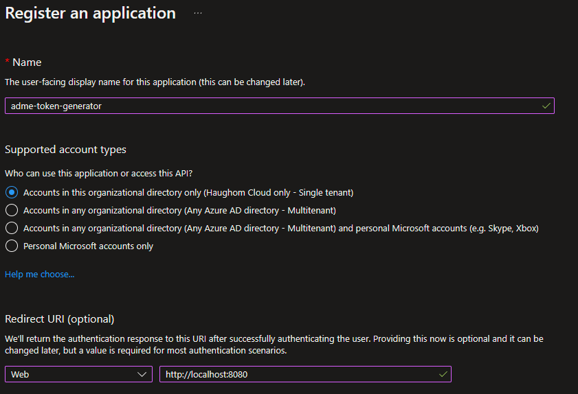

## Description
When using Azure Data Manager for Energy (ADME) we use access tokens to gain access into the ADME environment. Refresh tokens are often used to create new access tokens when they expire.

Both of these token creations require the App Registration client ID and secret to be presented in order to issue the token. 

Normally the client ID and secret is handled and stored securely by the backend application when authenticating in the front-end, inaccessible to the end-user.  

## Challenge
Since ADME doesn't have a front-end and is only accessible through the REST APIs, we cannot obfuscate/store & secure the client secret in the backend, inaccessible to the user. 

To increase the challenge; for ADME the App Registration is also the superuser/highest privileged account in ADME, with access to all data. Therefore we do not want to have end users utilize these credentials to fetch their access tokens.

There are two main solutions to address this:

1. Create a separate App Registration only used to provision tokens for end-users. These App Registration credentials will have no access to anything else.
2. Create a custom front-end app to generate access tokens on behalf of users using MSAL/Oauth2.

I will address solution 1 in this guide.

## Creating a Token-generating App Registration
1. Go to *Azure Active Directory* in the [Azure Portal](https://portal.azure.com)
2. Navigate to *App Registrations* and select the App Registration used to provision ADME
3. Go to *Expose an API* and enter the click ***Add a scope***
4. Enter the following details:
    ```
    Scope name:                     user_impersonation
    Who can consent:                Admins and users
    Admin consent display name:     Allows access to ADME
    ```
5. Create a new App Registration in your Azure AD
    

    > **Note**<br>
    > Define a Redirect URI of type **Web** with URI **http://localhost:8080**
6. On the new App Registration, go to *API Permissions* and click ***Add a permission***
7. Select ***My APIs*** and find the ADME main principal
8. Check the *user_impersonation* permission and click *Add permission*
9. Depending on policies you may have to grant admin consent, if so: Click Grant admin consent, or request this from your tenant administrators according to the [official documentation](https://learn.microsoft.com/en-us/azure/active-directory/manage-apps/grant-admin-consent?pivots=portal#grant-admin-consent-in-app-registrations)
10. Generate a new secret to be shared with the end users

## Verify solution
1. Generate an authorization code by customizing and open the URL below in your browser
    ```
    https://login.microsoftonline.com/{{tenant_id}}/oauth2/v2.0/authorize?
    client_id={{token_generator_client_id}}
    &response_type=code
    &redirect_uri=http%3a%2f%2flocalhost%3a8080
    &response_mode=query
    &scope={{adme_client_id}}%2f.default&state=12345&sso_reload=true
    ```
2. Generate access and refresh token by running the following API call
    ```ps
    curl --location 'https://login.microsoftonline.com/{{tenant_id}}/oauth2/v2.0/token' \
        --header 'Content-Type: application/x-www-form-urlencoded' \
        --data-urlencode 'client_id={{token_generator_client_id}}' \
        --data-urlencode 'scope={{adme_client_id}}/.default openid profile offline_access' \
        --data-urlencode 'code={{authorization_code}}' \
        --data-urlencode 'redirect_uri=http://localhost:8080' \
        --data-urlencode 'grant_type=authorization_code' \
        --data-urlencode 'client_secret={{token_generator_client_secret}}'
3. You should now get a response with an Access Token and a Refresh Token which can be used to authenticate into the ADME APIs.

### And you are done!
You have now created a separate app registration to generate tokens on behalf of the ADME main principal, while avoiding sharing the credentials of the superadmin!