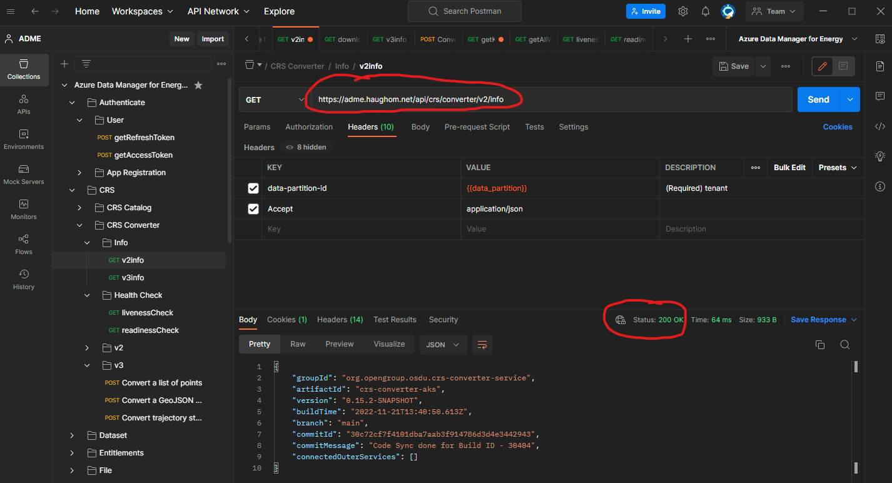

## Description
This guide is meant as an example on how to use Azure API Management (APIM) as a gateway with a custom DNS domain in front of Azure Data Manager for Energy (ADME) APIs. The solution allows you to brand your ADME instance with a domain name of your own choice, such as osdu.contoso.com instead of contoso.energy.azure.com.

### Supported configurations

API Management | ADME                        | Supported
---------------|:----------------------------|----------
External       | Public                      | Yes
External       | Internal (Private Endpoint) | Yes
Internal       | Public                      | Yes
Internal       | Internal (Private Endpoint) | Yes


## Prerequisites
- [Azure CLI](https://learn.microsoft.com/en-us/cli/azure/install-azure-cli) installed and logged into the target subscription.
- [Azure API Management](https://learn.microsoft.com/en-us/azure/api-management/get-started-create-service-instance-cli) instance with access to the ADME instance (i.e. VNET integrated if ADME is configured with Private Endpoint).

## Deployment
1. Deploy the custom domain to APIM following the [official documentation](https://learn.microsoft.com/en-us/azure/api-management/configure-custom-domain?tabs=custom).
2. Deploy the APIs to the APIM instance. 
    ```powershell
    # Variables
    $admeHostname = ".energy.azure.com"
    $resourceGroup = "myResourceGroup"
    $apimName = "myApiManagement"

    # Defines all of the APIs to load
    $apis = @(
        "crsConverter",
        "crsCatalog",
        "dataset",
        "entitlements",
        "file",
        "indexer",
        "legal",
        "notification",
        "partition",
        "register",
        "schema",
        "search",
        "seismicDdms",
        "storage",
        "unit",
        "wellboreDdms",
        "wellDeliveryDdms",
        "workflow"
    )

    # Defines the basePath and source of API definitions
    # Note: These are based off of OSDU M12 release definitions
    $apiDefinitions = @{
        crsConverter = @("api/crs/converter","https://raw.githubusercontent.com/EirikHaughom/ADME/main/Guides/Custom%20Domain/src/m12/crs_converter_openapi.yaml")
        crsCatalog = @("api/crs/catalog/v2","https://raw.githubusercontent.com/EirikHaughom/ADME/main/Guides/Custom%20Domain/src/m12/crs-catalog-openapi-v2.yaml")
        dataset = @("api/dataset/v1","https://raw.githubusercontent.com/EirikHaughom/ADME/main/Guides/Custom%20Domain/src/m12/dataset_swagger.yaml")
        entitlements = @("api/entitlements/v2","https://raw.githubusercontent.com/EirikHaughom/ADME/main/Guides/Custom%20Domain/src/m12/entitlements_openapi.yaml")
        file = @("api/file/v1","https://raw.githubusercontent.com/EirikHaughom/ADME/main/Guides/Custom%20Domain/src/m12/file_service_openapi.yaml")
        indexer = @("api/indexer/v2","https://raw.githubusercontent.com/EirikHaughom/ADME/main/Guides/Custom%20Domain/src/m12/indexer_openapi.yaml")
        legal = @("api/legal/v1","https://raw.githubusercontent.com/EirikHaughom/ADME/main/Guides/Custom%20Domain/src/m12/compliance_openapi.yaml")
        notification = @("api/notification/v1","https://raw.githubusercontent.com/EirikHaughom/ADME/main/Guides/Custom%20Domain/src/m12/notification_openapi.yaml")
        partition = @("api/partition/v1","https://raw.githubusercontent.com/EirikHaughom/ADME/main/Guides/Custom%20Domain/src/m12/partition_openapi.yaml")
        register = @("api/register/v1","https://raw.githubusercontent.com/EirikHaughom/ADME/main/Guides/Custom%20Domain/src/m12/register_openapi.yaml")
        schema = @("api/schema-service/v1","https://raw.githubusercontent.com/EirikHaughom/ADME/main/Guides/Custom%20Domain/src/m12/schema_openapi.yaml")
        search = @("api/search/v2","https://raw.githubusercontent.com/EirikHaughom/ADME/main/Guides/Custom%20Domain/src/m12/search_openapi.yaml")
        seismicDdms = @("/seistore-svc","https://raw.githubusercontent.com/EirikHaughom/ADME/main/Guides/Custom%20Domain/src/m12/seismic_ddms_openapi.yaml")
        storage = @("api/storage/v2","https://raw.githubusercontent.com/EirikHaughom/ADME/main/Guides/Custom%20Domain/src/m12/storage_openapi.yaml")
        unit = @("api/unit","https://raw.githubusercontent.com/EirikHaughom/ADME/main/Guides/Custom%20Domain/src/m12/unit_service_openapi_v3.yaml")
        wellboreDdms = @("/","https://raw.githubusercontent.com/EirikHaughom/ADME/main/Guides/Custom%20Domain/src/m12/wellbore_ddms_openapi.yaml")
        wellDeliveryDdms = @("api/well-delivery","https://raw.githubusercontent.com/EirikHaughom/ADME/main/Guides/Custom%20Domain/src/m12/welldelivery_ddms_openapi.yaml")
        workflow = @("api/workflow","https://raw.githubusercontent.com/EirikHaughom/ADME/main/Guides/Custom%20Domain/src/m12/workflow_openapi.yaml")
    }

    # Gets the custom domain assigned to APIM
    $customDomain = (az apim show --name $apimName --resource-group $resourceGroup | convertfrom-json).hostNameConfigurations.hostname | where { $_ -notlike "*.azure-api.net" }
    $customDomain = "https://"+$customDomain+"/"

    # Imports each api definition into the APIM instance
    foreach ($api in $apis) {
        $serviceUrl = "https://"+$admeHostname+"/"+$apiDefinitions[$api][0]

        Write-Host "Importing $api api"
        $output = az apim api import --resource-group $resourceGroup `
            --path $apiDefinitions[$api][0] `
            --service-name $apimName `
            --specification-format OpenApi `
            --specification-url $apiDefinitions[$api][1] `
            --protocols https `
            --service-url $serviceUrl `
            --subscription-required false
        $apiFqdn = ""
        $apiFqdn = $customDomain+$apiDefinitions[$api][0] -replace "$customDomain//","$customDomain/"

        if (!$output) {
            Write-Host "Import of $api api failed."  -ForegroundColor Red
        } else { 
            Write-Host "$api imported successfully to $apiFqdn."  -ForegroundColor Green
        }
    }
    ```
3. That's it! You should now have a Custom Domain enabled ADME instance.

## Tests and validations
It's always a good idea to test and validate that the APIs work as expected through the APIM using the custom domain name. 

### 1. Self-testing
Make API calls towards each API service and make sure it responds correctly. You could use my [Postman Collection](/Guides/Postman%20Collection/) to perform these tests efficiently.

### 2. Pre-defined smoke-tests
Use the smoke-tests from [ADME ExperienceLabs](https://github.com/microsoft/azure-data-manager-for-energy-experience-lab/tree/main/rest-scripts) to quickly test the various APIs.

### Example Response
