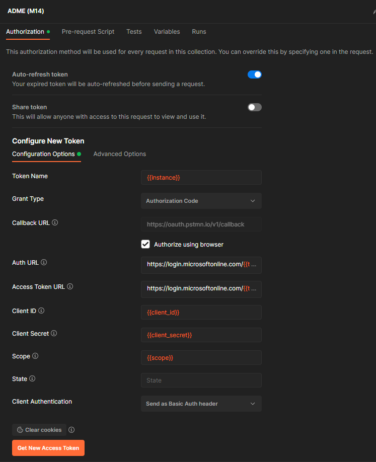
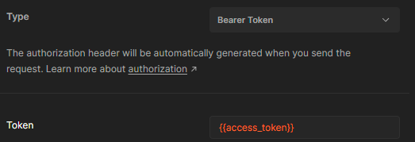

# API Collection

## Description

This postman collection includes all REST API calls available for Azure Data Manager for Energy (ADME) M18 core services. It is based on the native OSDU APIs, so it could also be used for anyone running a self-managed version of the OSDU M18 release.

## Services Covered

The services mentioned below are covered, and the API calls are imported from the official [ADME documentation](https://microsoft.github.io/adme-samples/).

- CRS Catalog
- CRS Converter
- Dataset
- EDS DMS
- Entitlements
- File
- Indexer
- Legal
- Notification
- Petrel DMS
- Register
- Schema
- Search
- Seismic DMS
- Seismic File Metadata
- Storage
- Unit
- Well Delivery DDMS
- Wellbore DDMS
- Workflow

## Usage

1. Copy the link to the [Postman Collection JSON file](./json/ADME.postman_collection.json?raw=1).
1. In Postman select *Import*.
1. Select *Link*.
1. Paste the link copied above.
1. Repeat the same for the [Postman Environment JSON file](./json/ADME.postman_environment.json?raw=1).

## Environment variables

| Variable |Format | Description |
|----------|-------|-------------|
|access_token|*N/A*|Value will be automatically populated by running the manual authentication API calls|
|refresh_token|*N/A*|Value will be automatically populated by running the manual authentication API calls|
|instance|contoso.energy.azure.com|Hostname of your ADME instance|
|client_id|00000000-0000-0000-0000-000000000000|The App Registration client ID used to provision ADME|
|data_partition|contoso-opendes|The Data Partition ID from ADME (i.e. eirik-opendes)|
|client_secret|*N/A*|A valid App Registration secret for the above client_id|
|tenant_id|00000000-0000-0000-0000-000000000000|Azure AD tenant ID|
|scope|00000000-0000-0000-0000-000000000000/.default openid profile offline_access|The scope to use when authenticating. The ID represents an App Registration ID (client_id)|
|baseUrl|https://{{instance}}|***Do not change***|

## Authenticating

### Interactive User Token (preferred)

Interactive login is the default authentication method. This will use open an interactive browser window and automatically authenticate and refresh access tokens.

1. Configure the following callback URL (Web) on the App Registration

    `https://oauth.pstmn.io/v1/callback`

1. Go to the top folder of the ADME API collection you have imported
1. Scroll to the bottom and click `Get New Access Token`

1. A new tab will open in your browser, complete the sign-in. *Note that you may have to allow pop-ups in your browser the first time.*
1. **You should now have obtained an Access Token to consume the APIs**

### Interactive Service Principal (App Registration)

Follow the procedure for [User Token](#interactive-user-token-preferred), but change the `Grant Type` to ***`Client Credentials`***.


### Manual User Token

Manual authentication requires some additional manual steps to generate the authorization code.

1. Go to the ADME API collection you have imported.
1. Select the top folder and choose the *Authorization* tab.
1. Change *Type* to `Bearer Token` and add {{access_token}} as the *Token* value.
1. Generate an `authentication code` by navigating to the following URL (replace {values} with your information):

```html
https://login.microsoftonline.com/{tenant_id}/oauth2/v2.0/authorize?client_id={client_id}&response_type=code&redirect_uri=http%3a%2f%2flocalhost%3a8080&response_mode=query&scope={client_id}%2f.default&state=12345&sso_reload=true
```

1. In the `Authenticate` folder, navigate into User folder and in the `getRefreshToken` API call body, add the authorization code to the `Body`.
1. Run the `getRefreshToken` call.
1. Make sure the Refresh Token is returned, and that it is now populated in the refresh_token environment variable.
1. Run the getAccessToken call.
1. Make sure the Access Token is returned, and that it is now populated in the access_token environment variable.

**Note** that the access_token is added automatically as a Bearer token to all requests (given that the user have authorization to use the APIs), and you do not need to explicitly define the authorization header.

> The authorization code is generated by browsing to `https://login.microsoftonline.com/{tenant_id}/oauth2/v2.0/authorize?client_id={client_id}&response_type=code&redirect_uri=http%3a%2f%2flocalhost%3a8080&response_mode=query&scope={client_id}%2f.default&state=12345&sso_reload=true`. Please note that the App Registration needs to have a web redirect URL set to `http://localhost:8080`. Please see the [official documentation](https://learn.microsoft.com/en-us/azure/energy-data-services/how-to-generate-refresh-token#get-authorization) for more information.</sub>

### Manual Service Principal (App Registration)

1. Go to the ADME API collection you have imported.
2. In the Authenticate folder, navigate into App Registration folder and run the `getAccessToken appRegistration` call.
3. Make sure the Access Token is returned, and that it is now populated in the access_token environment variable.

## Using the APIs

That's it! You should now be able to run all the API calls included.

## Changelog

```text
13/04-2024
Updated to M18 APIs
Added EDS
Added Petrel DMS
Added Seismic File Metadata service

25/04-2023
Corrected URI for Wellbore DDMS APIs

18/04-2023
ADME M14 release compliant
Added Seismic DDMS API
Added Well Delivery DDMS API
Added Wellbore DDMS API
Added Oauth2 authentication as default authentication mechanism

08/02-2023
Added Service Principal (App Registration) authentication mechanism.

06/02-2023
Added missing core services (Indexer, Notification, Register)

03/02-2023 
Initial publication of OSDU Collection
```
