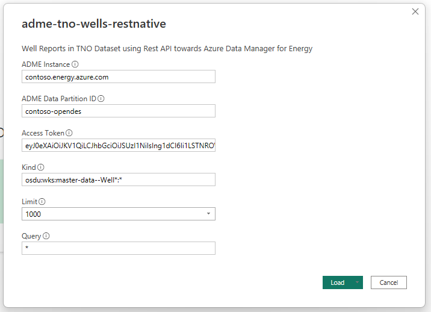

## Description
These Power BI templates are intended as examples to quickly start consuming data stored in Azure Data Manager for Energy (ADME).

## Templates
### TNO Template ([download](./src/adme-tno-wells-restnative.pbit))
The TNO template provides a ready-made template to visualize the [TNO dataset](https://community.opengroup.org/osdu/platform/data-flow/data-loading/open-test-data/-/tree/master/rc--3.0.0/1-data/3-provided/TNO) from ADME. It is mainly meant to prove the ability to consume and visualize data from ADME in Power BI.


### Generic Template ([download](./src/adme-generic-restnative.pbit))
The generic template offers no pre-defined visualizations, and is meant for you to quickly retrieve data from ADME and build your own visualizations.

#### Self-built query

You may build your own connection from scratch in stead of using the generic template. To get started, use the following Power Query:
```
let
    content =
            "{
                ""kind"" : """ & #"Kind" &""",
                ""query"" : """ & #"Query" &""",
                ""limit"" : """ & #"Limit" &"""
            }",
    apiUrl = "https://" & #"ADME Instance" & "/api/search/v2/query",
    Source = Json.Document(
            Web.Contents(
                apiUrl,
                [
                    Headers=[
                            #"Authorization" = "Bearer " & #"Access Token",
                            #"content-type" = "application/json",
                            #"data-partition-id" = #"ADME Data Partition ID",
                            #"accept" = "*/*"
                    ],
                    Content=Text.ToBinary(content)
                ]
            )
        ),
    results = Source[results]
in
    results
```

Then create the following parameters:
- ADME Instance
- ADME Data Partition ID
- Access Token
- Kind
- Query
- Limit

## Getting started
Download the chosen template above and provide the parameter values upon launch. Example:


## Known limitations

1. The connector uses Access Token to authenticate. While simple to use, it does expire after a short amount of time (up to 24 hours). Enter a new access token to continue building the report, or develop a separate authentication mechanism (such as refresh token, Oauth2 or similar).
2. Results are limited to maximum 1000 records due to [OSDU Search API](https://community.opengroup.org/osdu/platform/system/search-service/-/blob/master/docs/tutorial/SearchService.md) limitations. If more records are needed you will have to implement the [cursor search](https://community.opengroup.org/osdu/platform/system/search-service/-/blob/master/docs/tutorial/SearchService.md#query-with-cursor) capability.