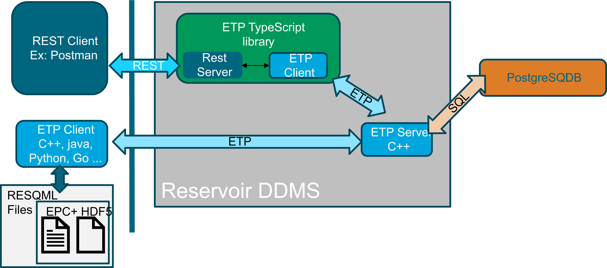
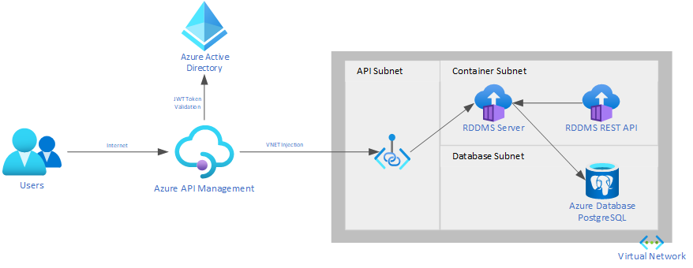

## Overview
The Reservoir Model DMS (RDDMS) is currently an experimental feature of OSDU and not part of Azure Data Manager for Energy.

This guide will explain how you can deploy a standalone version of the RDDMS on Azure Container Instance (ACI) with an Azure Database for PostgreSQL (PaaS), and secured with Azure AD authentication.

RDDMS consists of 3 main components:
1. OpenETPServer: Server component which interprets calls from the OpenETPClient.
2. Database (PostgreSQL): Database which stores the binary reservoir model files.
3. OpenETPClient: REST API and C++ client which interacts with OpenETPServer.
<br><br><br>


<br>

> ℹ️ A standalone RDDMS server will have no connection towards your OSDU or ADME instance, and is solely meant to be used to test the RDDMS capabilities itself, such as data ingestion, consumption etc.

<br>

## Details
In the [official documentation](https://community.opengroup.org/osdu/platform/domain-data-mgmt-services/reservoir/open-etp-server/-/tree/main), the RDDMS server (openETPServer), as well as the PostgreSQL database and RDDMS REST API (openETPClient), are deployed in a Docker instance. I have recompiled the images to ACI-compliant container image to host the RDDMS server and REST API, along with a PaaS Azure Db for PostgreSQL:
- Less management overhead (eliminates IaaS VM to host Docker)
- Simplified deployment using a generalized container image
- Database on PaaS for better resiliency, performance and less management overhead

In addition there are security concerns as the username (foo) and password (bar) is hardcoded on the OpenETPServer. Companies are therefore reluctant to expose the RDDMS over internet or even internally outside of an isolated environment, and thus may hamper user testing and experience. To combat this, we will:
- Use Azure API Management (APIM) as the API gateway, which means we can isolate the server to only reply to requests coming through the API gateway.
- Use APIM to authenticate requests using Azure AD by using JWT Token validation.


<br><br>

## Parts
The deployment is divided into two parts.

**Part 1** <br>
Part 1 allows you to run the RDDMS Server and REST API internally in a (isolated) VNET. You may peer the VNET if you want access from your corporate network.
This part consists of the following steps:
1.	Provision Virtual Network and Subnet infrastructure.
2.	Deploy the Azure Database for PostgreSQL.
3.	Deploy the RDDMS Server to Azure Container Instance.


**Part 2** <br>
Part 2 will deploy the RDDMS REST API and allow you to expose the RDDMS Server over internet, secured by Azure AD.
1.	Provision an Azure API Management instance.
2.	Deploy RDDMS REST API.
3.	Create API connection to RDDMS Server websocket API.
4.	Create Azure AD group for user validation.
5.	Apply API inbound policy to restrict access to your Azure AD tenant and the Azure AD group.

<br>

# Part 1

## Prerequisites
[Azure CLI](https://learn.microsoft.com/en-us/cli/azure/install-azure-cli) installed and logged into the target subscription.

## Preparation
1. Define variables
    ```Powershell
    ### RESOURCE GROUP ###
    $resourceGroup = "myResourceGroup" # name of the resource group (will be created if it doesn't exist)
    $location = "westeurope" # location where to deploy all resources

    ### RDDMS SERVER AND REST API ###
    $jwtSecret = "osdu-rddms" # This is the default secret in RDDMS, please change to create a stronger signature for the JWT tokens.
    $rddmsServerName = "rddms-server" # Name of the ACI container hosting the RDDMS Server
    $rddmsServerPort = "9002" # This is the default port for the RDDMS Server, change if needed
    $rddmsApiName = "rddms-restapi" # Name of the ACI container hosting the RDDMS REST API 
    $rddmsApiPort = "8003" # This is the default port for the RDDMS REST API, change if needed
    $containerRegistryName = "" # [Unique] Name of the Azure Container Registry

    ### POSTGRESQL SERVER ###
    $dbServerName = "" # [Unique] Name of the Azure Db for PostgreSQL server
    $dbServerUsername = "azureuser" # Username of the database admin
    $dbServerPassword = "" # Password of the database user
    
    ### AZURE API MANAGEMENT ###
    $apiName = "" # [Unique] Name of the Azure API Management instance 
    $apiPublisherEmail = "user@contoso.com" # Email to receive notifications about the APIM instance
    $apiPublisherName = "Jane Doe" # Name to receive notifications
    $azureAdGroupName = "rddms-users" # [Unique] name of the Azure AD group to use for access permissions to use the RDDMS server API

    ```
2. Azure Virtual Network with three subnets (ACI, db and APIM)
    ```Powershell
    # Create Resource Group if it doesn't exist
    if ((az group exists --resource-group $resourceGroup) -eq "false") {
        az group create --resource-group $resourceGroup --location $location
    }

    # Create Virtual Network
    $vnet = az network vnet create --resource-group $resourceGroup `
    --name myName `
    --address-prefix 10.1.0.0/16
    $vnet = ($vnet | convertfrom-json).newvnet

    # Create subnet for the containers
    $containerSubnet = az network vnet subnet create --resource-group $resourceGroup `
    --name containerSubnet `
    --address-prefix 10.1.0.0/24 `
    --vnet-name $vnet.name `
    --delegations Microsoft.ContainerInstance/containerGroups
    $containerSubnet = $containerSubnet | convertfrom-json

    # Create subnet for the database
    $dbSubnet = az network vnet subnet create --resource-group $resourceGroup `
    --name dbSubnet `
    --address-prefix 10.1.1.0/24 `
    --vnet-name $vnet.name
    $dbSubnet = $dbSubnet | convertfrom-json

    # Create subnet for the Azure API Management
    $apiSubnet = az network vnet subnet create --resource-group $resourceGroup `
    --name apiSubnet `
    --address-prefix 10.1.2.0/24 `
    --vnet-name $vnet.name
    $apiSubnet = $apiSubnet | convertfrom-json
    ```
<br>

## Deploying the PostgreSQL Database
1. Create a new Azure Database for PostgreSQL server.
    ```Powershell
    $dbServer = az postgres server create --resource-group $resourceGroup `
    --name $dbServerName `
    --admin-user $dbServerUsername `
    --admin-password $dbServerPassword `
    --sku-name GP_Gen5_2 `
    --public-network-access disabled `
    --ssl-enforcement disabled `
    --version 11
    $dbServer = $dbServer | convertfrom-json
    ```
2. Create Private Link and Private DNS Zone for the PostgreSQL server.
    ```Powershell
    $nicName = $dbServer.name+"-nic"
    $connName = $dbServer.name+"-privateEndpoint"
    $privateLinkName = $vnet.name+"-postgres-dnslink"

    # Create Private Endpoint
    $privateEndpoint = az network private-endpoint create --resource-group $resourceGroup `
    --name $nicName `
    --vnet-name $vnet.name `
    --subnet $dbSubnet.name `
    --private-connection-resource-id $dbServer.id `
    --group-id postgresqlServer `
    --connection-name $connName
    $privateEndpoint = $privateEndpoint | convertfrom-json

    # Create Private DNS Zone
    az network private-dns zone create --resource-group $resourceGroup `
    --name  "privatelink.postgres.database.azure.com" 

    # Link Private DNS Zone to VNET
    az network private-dns link vnet create --resource-group $resourceGroup `
    --zone-name  "privatelink.postgres.database.azure.com" `
    --name $privateLinkName `
    --virtual-network $vnet.name `
    --registration-enabled false

    # Create a-record in the Private DNS Zone
    az network private-dns record-set a create --resource-group $resourceGroup `
    --name $dbServer.name `
    --zone-name privatelink.postgres.database.azure.com 

    # Add Private IP address to the a-record
    az network private-dns record-set a add-record --resource-group $resourceGroup `
    --record-set-name $dbServer.name `
    --zone-name privatelink.postgres.database.azure.com `
    -a $privateEndpoint.customDnsConfigs.ipAddresses
    ```
3. Create a database on the PostgreSQL server.
    ```Powershell
    $db = az postgres db create --resource-group $resourceGroup `
    --name rddms `
    --server-name $dbServer.name
    $db = $db | convertfrom-json
    ```
<br><br>

## Deploying the RDDMS Server
1. Create an Azure Container Registry (ACR) to host the Container Image.
    ```Powershell
    $acr = az acr create --resource-group $resourceGroup `
    --name $containerRegistryName `
    --sku Basic `
    --admin-enabled true
    $acr = $acr | convertfrom-json

    # Gets admin credentials for the AC, to be used when creating container later on.
    $acrCreds = az acr credential show --name $acr.name
    $acrCreds = $acrCreds | convertfrom-json
    $acrUsername = $acrCreds.username
    $acrPassword = $acrCreds.passwords.value[0]    
    ```
2. Pull the image from public repository into your ACR.
    ```Powershell
    az acr import -n $acr.name `
    --source rddms.azurecr.io/open-etp-server-eihaugho-aci:latest
    ```
3. Create Azure Container Instance based on the image.
    ```Powershell
    $containerImage = $acr.loginServer+"/open-etp-server-eihaugho-aci:latest"
    $connString = "host="+$dbServer.fullyQualifiedDomainName+" port=5432 dbname="+$db.name+" user="+$dbServer.administratorlogin+"@"+$dbServer.name+" password="+$dbServer.password
    $cmd = "openETPServer server --start --port "+$rddmsServerPort+" --jwt-secret "+$jwtSecret

    $rddmsServer = az container create --resource-group $resourceGroup `
    --name $rddmsServerName `
    --dns-name-label $rddmsServerName `
    --image $containerImage `
    --registry-username $acrUsername `
    --registry-password $acrPassword `
    --ports $rddmsServerPort `
    --environment-variables `
    RDMS_DATA_PARTITION_MODE=single `
    POSTGRESQL_CONN_STRING=$connString `
    --command-line $cmd `
    --ip-address Public
    $rddmsServer = $rddmsServer | convertfrom-json

    $rddmsServerUrl = "ws://"+$rddmsServer.ipAddress.ip+":"+$rddmsServerPort

    Write-Host "The RDDMS Server is now accessible internally on $rddmsServerUrl" -ForegroundColor green 
    Write-Host "Proceed with Phase 2 to deploy the API Gateway and REST API for public access" -ForegroundColor green 
    ```
<br>

# Part 2

## Deploying Azure API Management
1. Create a new Azure API Management (APIM) instance.
    ```Powershell
    $nicName = $apiName+"-nic"
    $connName = $apiName+"-privateEndpoint"
    $privateLinkName = $vnet.name+"-api-dnslink"

    az apim create --resource-group $resourceGroup `
    --name $apiName `
    --publisher-email $apiPublisherEmail `
    --publisher-name $apiPublisherName `
    --public-network-access true `
    --sku-name Developer `
    --virtual-network External
    ```

2. ⚠️ **Wait until the APIM instance is activated before you continue.** This may take ~1 hour to complete. You will receive an email (to the one specified in $apiPublisherEmail) once it is activated.
    ```Powershell
    # Get the details from the provisioned APIM instance
    $api = az apim show --name $apiName --resource-group $resourceGroup | convertfrom-json

    $apiId = $api.id
    $apiSubnetId = $apiSubnet.id

    # Add subnet configuration to the APIM resource
    az resource update --ids $apiId --set properties.virtualNetworkConfiguration.subnetResourceId=$apiSubnetId --set properties.virtualNetworkType=External
    ```
    <br>

## Deploying the RDDMS Client (REST API)
1. Pull the image from public repository into your ACR.
    ```Powershell
    az acr import -n $acr.name `
    --source rddms.azurecr.io/open-etp-restapi-eihaugho-aci:latest
    ```

2. Create Azure Container Instance based on the image.
    ```Powershell
    $containerImage = $acr.loginServer+"/open-etp-restapi-eihaugho-aci:latest"
    $rmdsRestMainUrl = $api.gatewayUrl
    $rdmsEtpHost = $rddmsServer.ipAddress.ip

    az container create --resource-group $resourceGroup `
    --name $rddmsApiName `
    --image $containerImage `
    --registry-username $acrUsername `
    --registry-password $acrPassword `
    --ports $rddmsApiPort `
    --environment-variables `
    RDMS_ETP_HOST=$rdmsEtpHost `
    RDMS_ETP_PROTOCOL=ws `
    RDMS_ETP_PORT=$rddmsServerPort `
    RDMS_REST_PORT=$rddmsApiPort `
    RDMS_JWT_SECRET=$jwtSecret `
    RDMS_AUTHENTICATION_KEY_BASE=0000000-0000-0000-0000-000000000000 `
    RDMS_REST_ROOT_PATH=/Reservoir/v2 `
    RDMS_REST_MAIN_URL=$rmdsRestMainUrl `
    RDMS_DATA_PARTITION_MODE=single `
    --ip-address Private `
    --vnet $vnet.name `
    --subnet $containerSubnet.id
    ```
    <br>

## Deploy RDDMS Server to APIM and add Azure AD authentication
1. Deploy the RDDMS Server Websocket API to APIM
    ```Powershell 
    $serviceUrl = "ws://"+$rddmsServer.ipAddress.ip+":"+$rddmsServerPort

    $websocketApi = az apim api create --resource-group $resourceGroup `
    --api-id $rddmsServerName `
    --display-name $rddmsServerName `
    --path "/" `
    --service-name $api.name `
    --api-type websocket `
    --service-url $serviceUrl `
    | convertfrom-json
    ```

2. Create Azure AD group which will have access to call the RDDMS server API.
    ```Powershell
    $adGroup = az ad group create `
    --display-name $azureAdGroupName `
    --mail-nickname $azureAdGroupName `
    | convertfrom-json
    ```

3. Add JWT token validation policy to APIM. 
<br>Azure CLI currently do not support APIM policy configuration, for a programmatic approach you can use the [Az.ApiManagement](https://learn.microsoft.com/en-us/powershell/module/az.apimanagement/?view=azps-9.4.0) PowerShell module.
    ```powershell
    # Configure JWT token Azure AD validation
    $environment = az account show | convertfrom-json 
    $tenantId = $environment.tenantId
    $subscriptionId = $environment.id
    $groupId = $adGroup.id
    $apiName = $api.name
    $apiId = $api.id

    $policy = @"
    <policies>
        <inbound>
            <base />
            <validate-azure-ad-token tenant-id="$tenantId" failed-validation-httpcode="401">
                <client-application-ids>
                    <application-id>04b07795-8ddb-461a-bbee-02f9e1bf7b46</application-id>
                </client-application-ids>
                <required-claims>
                    <claim name="groups" match="all">
                        <value>$groupId</value>
                    </claim>
                </required-claims>
            </validate-azure-ad-token>
            <set-header name="Authorization" exists-action="override">
                <value>Basic Zm9vOmJhcg==</value>
            </set-header>
        </inbound>
        <backend>
            <base />
        </backend>
        <outbound>
            <base />
        </outbound>
        <on-error>
            <base />
        </on-error>
    </policies>
    "@

    Write-Host "Open https://portal.azure.com/#@$tenantId/resource$apiId/apim-apis"

    Write-Host "Select the $websocketApi.Name and open the code editor view for Inbound policy. Replace the entire config with the following:"
    $policy

    ```

4. That's it! You should now be able to connect to the RDDMS Server websocket API using JWT tokens from Azure CLI.<br><br>

## Test and validate
1. Install [Docker Desktop](https://www.docker.com/products/docker-desktop/) locally.
2. Fetch the RDDMS SSL Client container image.
    ```PowerShell
    # Download docker container image
    docker pull community.opengroup.org:5555/osdu/platform/domain-data-mgmt-services/reservoir/open-etp-server/open-etp-sslclient-release-0-19

    # Rename to open-etp:ssl-client
    docker tag community.opengroup.org:5555/osdu/platform/domain-data-mgmt-services/reservoir/open-etp-server/open-etp-sslclient-release-0-19 open-etp:ssl-client
    ```
3. Run the below command to test access to the RDDMS Websocket API
    ```PowerShell
    # Define variables
    $websocketExternalUrl = "wss://"+$websocketApi.Name+".azure-api.net/"+$websocketApi.path

    # Fetch an Access Token
    $accessToken = az account get-access-token --tenant $tenantId | convertfrom-json

    # Create a new dataspace
    docker run -it --rm open-etp:ssl-client openETPServer space -S $websocketExternalUrl --new -s demo/Volve --auth bearer --jwt-token $accessToken.accessToken

    # List dataspaces
    docker run -it --rm open-etp:ssl-client openETPServer space -S $websocketExternalUrl -l --auth bearer --jwt-token $accessToken.accessToken
    ```
4. See more examples of end-to-end testing in the [official documentation](https://community.opengroup.org/osdu/platform/domain-data-mgmt-services/reservoir/open-etp-server/-/blob/main/docs/testing.md).
<br><br>

## Work in Progress

### Exposing the RDDMS REST API over internet with APIM.
