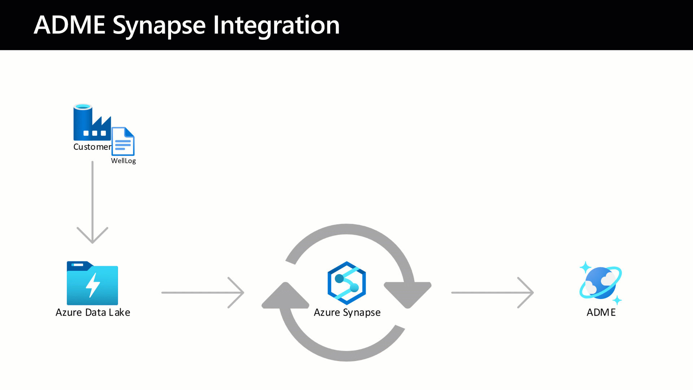

# Description
The intent with this solution is to automatically ingest binary data created on an external datastore into Microsoft Energy Data Services. While the example uses an Azure Data Lake, any compatible storage solutions could theoretically be used.



# Shared Prerequisites
These prerequisites is needed to deploy the solution above. Expand each prerequisite in the list below to see example code.
<details>
<summary>Azure CLI</summary>

Download from [aka.ms/azurecli](https://aka.ms/azurecli).  
Login to the Azure CLI using the command below, and your user with subscription owner rights:
```Powershell
az login
```
Verify that the right subscription is selected:
```Powershell
az account show
```
If the correct subscription is not selected, run the following command:
```Powershell
az account set --subscription %subscription_id%
```
</details>

<details>
<summary>Azure Resource Providers</summary>

```Powershell
az provider register --namespace Microsoft.DataFactory
az provider register --namespace Microsoft.DataLakeStore
az provider register --namespace Microsoft.OpenEnergyPlatform
az provider register --namespace Microsoft.Sql
az provider register --namespace Microsoft.Storage
az provider register --namespace Microsoft.Synapse
```
</details>

<details>
<summary>Azure Resource Group</summary>

```Powershell
az group create `
    --name <resource-group> `
    --location <location>
```
<details open>
<summary>Example</summary>

```Powershell
az group create `
    --name medssynapse-rg `
    --location westeurope
```
</details>
</details>

<details>
<summary>Azure Data Lake Storage or Azure Storage Account</summary>

```Powershell
az storage account create `
    --name <storage-account> `
    --resource-group <resource-group> `
    --sku Standard_LRS `
    --hns true
```
<details open>
<summary>Example</summary>

```Powershell
az storage account create `
    --name eirikmedsadls `
    --resource-group medssynapse-rg `
    --sku Standard_LRS `
    --hns true
```
</details>

Then create a container to use as the source.
```Powershell
az storage container create `
    --account-name <storage-account> `
    --name <container> `
    --auth-mode login
```
<details open>
<summary>Example</summary>

```Powershell
az storage container create `
    --account-name eirikmedsadls `
    --name medssource `
    --auth-mode login
```
</details>
</details>

<details>
<summary>Azure Synapse Workspace</summary>

```Powershell
az synapse workspace create `
    --name <workspace-name> `
    --file-system <filesystem> `
    --resource-group <resource-group> `
    --storage-account <storage-account>`
    --sql-admin-login-user <username> `
    --sql-admin-login-password <password> 
```
<details open>
<summary>Example</summary>

```Powershell
az synapse workspace create `
    --name eirikmedssynapse `
    --file-system synapsefs `
    --resource-group medssynapse-rg `
    --storage-account eirikmedsadls `
    --sql-admin-login-user mysqladmin `
    --sql-admin-login-password mysqlpassword1! 
```
</details>

Open the Synapse Workspace for public access.

```Powershell
az synapse workspace firewall-rule create `
    --name <rule-name> `
    --resource-group <resource-group> `
    --workspace-name <workspace-name> `
    --start-ip-address <start-ip> `
    --end-ip-address <end-ip>
```
<details open>
<summary>Example</summary>

```Powershell
az synapse workspace firewall-rule create `
    --name allowAll `
    --resource-group medssynapse-rg `
    --workspace-name eirikmedssynapse `
    --start-ip-address 0.0.0.0 `
    --end-ip-address 255.255.255.255
```
</details>
</details>

<details>
<summary>Microsoft Energy Data Services</summary>

As this is a gated Public Preview product, please see the instructions at [learn.microsoft.com](https://learn.microsoft.com/en-us/azure/energy-data-services/quickstart-create-microsoft-energy-data-services-instance).
</details><br />

# Authentication Mechanism
There are two main ways to authenticate your API calls towards Microsoft Energy Data Services. You should only choose one of these and follow the guide for the one you selected throughout. 

> **_NOTE:_**  Click the header link of your chosen authentication method to proceed with the pipeline deployment.

## [Alt 1. Managed Identity](deploy-mi.md)
This will use the managed identity of your Synapse Workspace in conjunction with the scope of the Microsoft Energy Data Services Application Registration. This will be the easiest way to authenticate, as no secrets needs to be stored for the runtime to work. However, security policies may be in place preventing this authentication mechanism.

### Pros
- Less prerequisites and configuration
- Less secrets management
- Pipeline runs are quicker due to less activities

### Cons
- May be restricted by policy

## [Alt 2. Access Token](deploy-token.mi) (WORK IN PROGRESS)
This authentication method will use an Application Registration to fetch an access token and parse this in the API requests. 

### Pros
- Easier to debug
- Should work "no matter what"

### Cons
- Additional prerequisites required
- Pipeline runs slower due to additional Token activities
