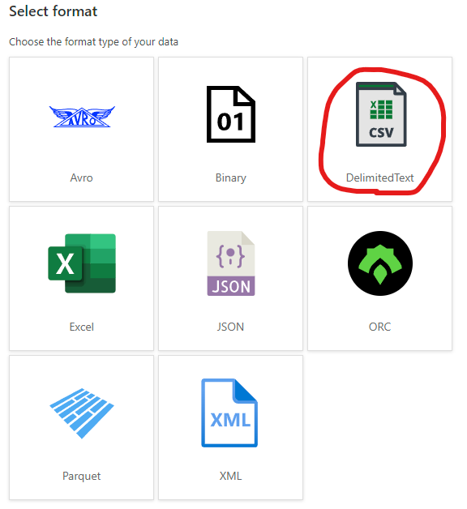
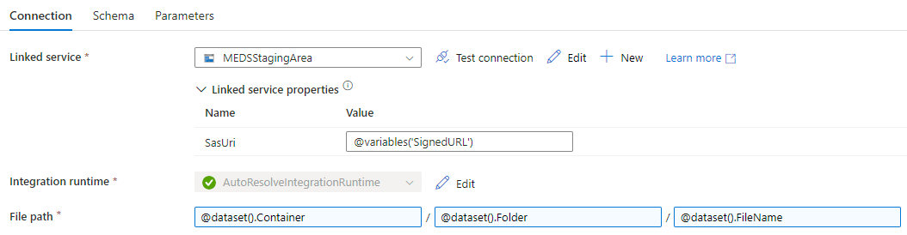

# Description
The intent with this solution is to automatically ingest binary data created on an external datastore into Microsoft Energy Data Services. While the example uses an Azure Data Lake, any compatible storage solutions coult theoretically be used.

# Prerequisites
These prerequisites is needed to deploy the solution above.
1. Azure Data Lake or Azure Storage Account*
2. Azure KeyVault
3. Azure Synapse Workspace

*Or other storage solution supported as a Linked Service in Synapse.

# Deploy
## Grant permissions
The Azure Synapse Workspace needs direct access to the prerequisites noted above, make sure you configure the permissions on those accordingly. I've used the Managed Identity of the Synapse Workspace.

* Grant Synapse Workspace *Storage Contributor* rights on the Storage Account*
* Grant Synapse Workspace access to KeyVault
    * If using Azure RBAC/IAM: *Key Vault Reader*
    * If using Access Policies: *Secret Permissions (Get, List)*

*If using a shared Storage Account, the rights can be set at a lower level (i.e. individual container)

## Storage Setup
### Create Source Linked Service
Here we will create the Source Linked Service.

1. Go to your [Synapse Workspace](https://web.azuresynapse.net/en/management/datalinkedservices)
2. Select Manage
3. Select Linked Services under External connections
4. Click New to create a new Linked Service
5. Choose the storage technology and enter the details

6. Enter a Name, Authentication type and either browse or manually enter the ADLS

7. Run the Test Connection to verify the connection
8. Click Create

### Create Source Dataset
Next we'll create the Source Dataset.

1. Go to Data
2. Click the + and add a new Integration Dataset
3. Select the same storage technology as created in the previous chapter

4. Select the data format, we'll be using DelimitedText

5. Configure the Linked service to use the Linked Service we created in the previous chapter
6. Click Browse and select the relevant *container* on your Linked Service
7. Click Create

### Configure Source Dataset
As we want to automatically ingest any files added to the ADLS, we need to have a dynamic parameter as the File Name. We will set up the file name to resolve to a parameter on the dataset, which in turn resolves to a variable in the Synapse Pipeline.

1. Head to Parameters on the newly created Dataset
2. Add a new Parameter called FileName, with the Default value as follows:
```
@variables('SourceFileName')
```

3. Go back to Connection and select the File name field, click *Add dynamic content*

4. Click the FileName parameter or enter it manually
```
@dataset().FileName
```
5. Click OK

Full JSON:
```
{
    "name": "MEDSSourceDataset",
    "properties": {
        "linkedServiceName": {
            "referenceName": "eiriksynapse-WorkspaceDefaultStorage",
            "type": "LinkedServiceReference"
        },
        "parameters": {
            "FileName": {
                "type": "string",
                "defaultValue": "@variables('SourceFileName')"
            }
        },
        "annotations": [],
        "type": "DelimitedText",
        "typeProperties": {
            "location": {
                "type": "AzureBlobFSLocation",
                "fileName": {
                    "value": "@dataset().FileName",
                    "type": "Expression"
                },
                "fileSystem": "medssource"
            },
            "columnDelimiter": ",",
            "escapeChar": "\\",
            "quoteChar": "\""
        },
        "schema": []
    }
}
```

### Create Destination Linked Service
As the Microsoft Energy Data Services File API always returns unique staging areas for any binary file ingestions, we need to have a dynamic Linked Service created which uses variables from the Pipeline, namely the SignedURL.

1. Create a new Linked Service
2. Make sure to select SAS URI as Authentication type
3. Enter the following Linked Service parameter as SAS URL
```
@(linkedService().SasUri)
```
4. Leave SAS token empty, as this will be dynamically updated through the SAS URL from the pipeline.
5. Add a Parameter called SasUri with the following Default value
```
@variables('SignedURL')
```
6. Click Create

Full JSON:
```
{
    "name": "MEDSStagingArea",
    "type": "Microsoft.Synapse/workspaces/linkedservices",
    "properties": {
        "parameters": {
            "SasUri": {
                "type": "string",
                "defaultValue": "@variables('SignedURL')"
            }
        },
        "annotations": [],
        "type": "AzureBlobStorage",
        "typeProperties": {
            "sasUri": "@{linkedService().SasUri}"
        },
        "connectVia": {
            "referenceName": "AutoResolveIntegrationRuntime",
            "type": "IntegrationRuntimeReference"
        }
    }
}
```

### Create Destination Dataset
Microsoft Energy Data Services also always creates new temporary staging locations for ingestion jobs, so we need a dynamic dataset that will get the Container, Folder and File Name from the Pipeline.

1. Create a new Integration dataset using Blob as storage technology and DelimitedText as Data Format.
2. Select the Linked Service for the dynamic Microsoft Energy Data Services staging area created above.
3. Leave File path blank for now
4. Click OK


### Configure Destination Dataset
Now we will create the needed parameters on the dataset to be able to resolve to the pipeline variables, and assign those parameters to the File path.

1. Enter the Destination dataset and add the following Parameters
 - FileName
```
@variables('FileName')
```
- Folder
```
@variables('Folder')
```
- Container
```
@variables('Container')
```
2. Go back to Connection and dynamically refer to those Parameters


Full JSON:
```
{
    "name": "MEDSSinkDataset",
    "properties": {
        "linkedServiceName": {
            "referenceName": "MEDSStagingArea",
            "type": "LinkedServiceReference",
            "parameters": {
                "SasUri": "@variables('SignedURL')"
            }
        },
        "parameters": {
            "FileName": {
                "type": "string",
                "defaultValue": "@variables('FileName')"
            },
            "Folder": {
                "type": "string",
                "defaultValue": "@variables('Folder')"
            },
            "Container": {
                "type": "string",
                "defaultValue": "@variables('Container')"
            }
        },
        "annotations": [],
        "type": "DelimitedText",
        "typeProperties": {
            "location": {
                "type": "AzureBlobStorageLocation",
                "fileName": {
                    "value": "@dataset().FileName",
                    "type": "Expression"
                },
                "folderPath": {
                    "value": "@dataset().Folder",
                    "type": "Expression"
                },
                "container": {
                    "value": "@dataset().Container",
                    "type": "Expression"
                }
            },
            "columnDelimiter": ",",
            "escapeChar": "\\",
            "quoteChar": "\""
        },
        "schema": []
    },
    "type": "Microsoft.Synapse/workspaces/datasets"
}
```

## Create Pipeline
