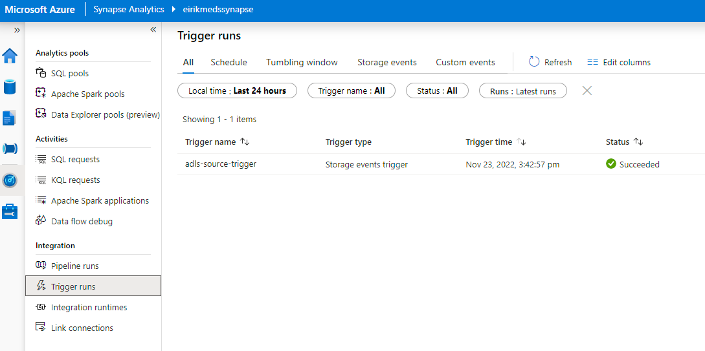
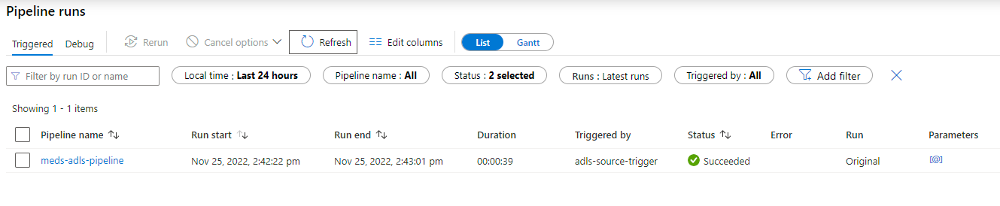
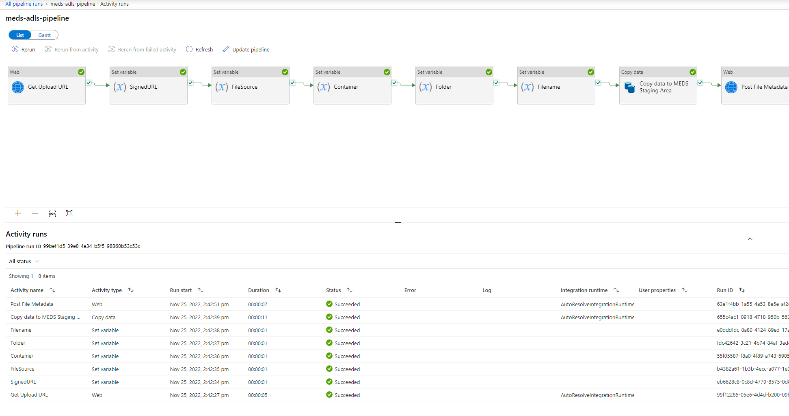
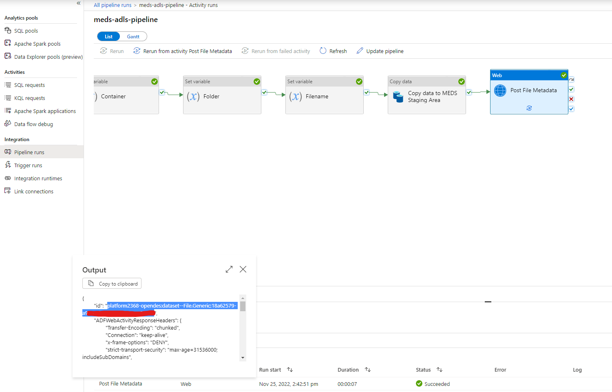

# Test and validation

## Check that trigger has been triggered
In the Synapse Studio (web portal), go to *Monitor* and then *Trigger runs*.
Verify that the trigger has successfully run immediately after uploading the file to the container.



## Check that pipeline has run successfully
In the Synpase Studio (web portal), go to *Monitor* and then *Pipeline runs*. 
Verify that the pipeline completes or has completed successfully.



You may also enter the pipeline to validate each step.



## Fetch file generic (record ID) and validate that the file is consistent

Get the output id from the Post File Metadata step in the pipeline.



Now download the file from Microsoft Energy Data Services using the record ID.

```Powershell
curl -X 'GET' `
  'https://<instance>.energy.azure.com/api/file/v2/files/<record-ID>/downloadURL?expiryTime=1D' `
  -H 'accept: application/json' `
  -H 'data-partition-id: <data-partition>' `
  -H 'Authorization: Bearer <access-token>'
```